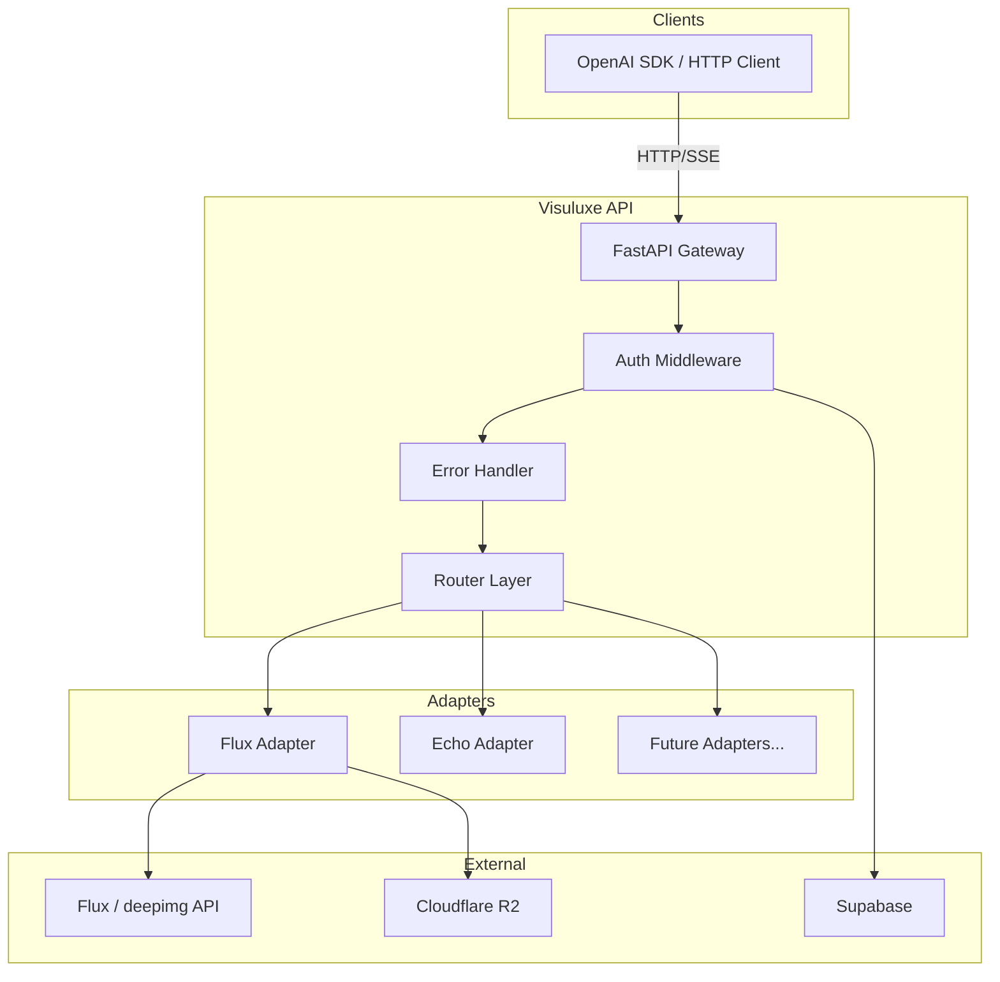
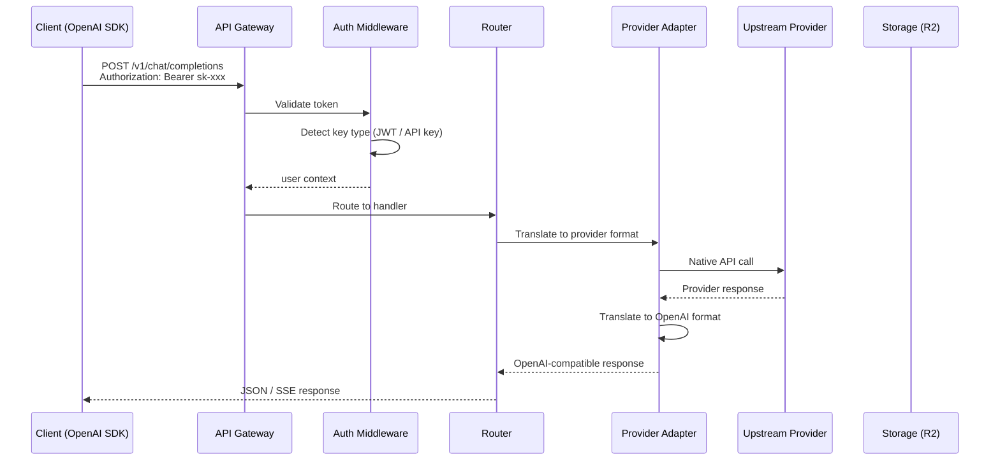
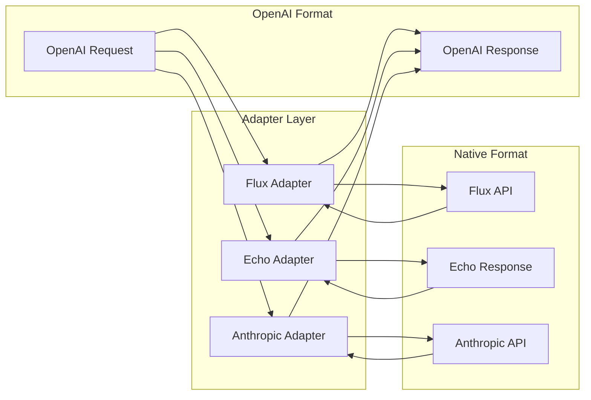

# Visuluxe

An OpenAI-compatible API gateway for AI image generation, chat completions, text completions, and embeddings. Use any OpenAI SDK by pointing `base_url` at your Visuluxe instance -- no code changes required.

---

## Table of Contents

- [Overview](#overview)
- [Architecture](#architecture)
- [Features](#features)
- [API Reference](#api-reference)
- [Installation](#installation)
- [Configuration](#configuration)
- [Usage Examples](#usage-examples)
- [Deployment](#deployment)
- [Troubleshooting](#troubleshooting)

---

## Overview

Visuluxe is a production-grade SaaS platform that exposes a **fully OpenAI-compatible REST API** backed by pluggable provider adapters. The system routes requests through a FastAPI backend that translates between the OpenAI wire format and the native format of each upstream provider (Flux, Anthropic, local models, Ollama, etc.).

### Supported Providers

| Provider | Capabilities | Status |
|---|---|---|
| **Flux (deepimg.ai)** | Image generation | Production |
| **Echo (built-in)** | Chat, completions, embeddings | Testing / reference |
| Anthropic | Chat completions | Planned |
| Ollama | Chat, completions, embeddings | Planned |
| vLLM | Chat, completions | Planned |

---

## Architecture

### High-Level System Diagram



### Request Flow



### Provider Adapter Layer



### Backend Directory Structure

```
backend/
├── app/
│   ├── main.py              # FastAPI app, lifespan, router registration
│   ├── config.py             # Pydantic settings from environment
│   ├── security.py           # JWT, API key, internal secret auth
│   ├── errors.py             # OpenAI-compatible error handling
│   ├── adapters/             # Provider translation layer
│   │   ├── base.py           #   Abstract base adapter
│   │   ├── flux.py           #   Flux image generation adapter
│   │   ├── echo.py           #   Echo/test adapter (chat, completions, embeddings)
│   │   └── registry.py       #   Model-to-adapter routing
│   ├── models/
│   │   ├── schemas.py        #   Legacy Pydantic schemas
│   │   └── openai_schemas.py #   OpenAI-compatible request/response models
│   ├── routers/
│   │   ├── chat_completions.py  # POST /v1/chat/completions
│   │   ├── completions.py       # POST /v1/completions
│   │   ├── embeddings.py        # POST /v1/embeddings
│   │   ├── images.py            # POST /v1/images/generations
│   │   ├── models.py            # GET  /v1/models
│   │   ├── auth.py              # GET  /v1/auth/me
│   │   └── admin.py             # Admin endpoints
│   ├── services/
│   │   ├── credit.py         # Credit check, reservation, refunds
│   │   ├── database.py       # Supabase database operations
│   │   ├── processor.py      # Background job processing loop
│   │   ├── provider.py       # Model/provider DB queries
│   │   ├── queue.py          # Cloudflare Queue integration
│   │   ├── r2.py             # R2 upload helpers
│   │   └── storage.py        # S3-compatible R2 storage (boto3)
│   └── workers/
│       └── base.py           # Worker registry and Flux worker
├── run_worker.py             # Standalone worker process
├── Dockerfile
├── docker-compose.yml
└── requirements.txt
```

---

## Features

- **Full OpenAI API compatibility** -- works with Python `openai`, Node `openai`, and any HTTP client
- **Streaming (SSE)** -- real-time token streaming for chat completions
- **Tool calling & function calling** -- pass tools/functions exactly as with OpenAI
- **Multi-provider support** -- pluggable adapter layer translates between providers
- **Image generation** -- Flux-powered image generation via `/v1/images/generations`
- **Embeddings** -- `/v1/embeddings` endpoint
- **Credit management** -- automatic credit check, reservation, and refund
- **Three auth methods** -- JWT tokens, API keys (`sk-xxx`), and internal secrets
- **OpenAI error format** -- all errors return the standard `{ "error": { ... } }` envelope
- **Background job queue** -- Cloudflare Queues with database fallback
- **Private image storage** -- Cloudflare R2 with signed URLs
- **Admin panel** -- user management, model configuration, analytics
- **Rate limiting** -- configurable RPM/RPD per API key

---

## API Reference

### Authentication

All endpoints require authentication via one of:

| Method | Header | Example |
|---|---|---|
| API Key (OpenAI-style) | `Authorization: Bearer sk-xxx` | `Authorization: Bearer sk-abc123...` |
| API Key (explicit) | `X-API-Key: sk-xxx` | `X-API-Key: sk-abc123...` |
| JWT Token | `Authorization: Bearer <jwt>` | `Authorization: Bearer eyJhbG...` |
| Internal Secret | `X-Internal-Secret: <secret>` | Server-to-server only |

### `GET /v1/models`

List all available models.

**Response:**

```json
{
  "object": "list",
  "data": [
    {
      "id": "flux-dev",
      "object": "model",
      "created": 1700000000,
      "owned_by": "visuluxe",
      "permission": [],
      "root": "flux-dev",
      "parent": null
    }
  ]
}
```

**curl:**

```bash
curl https://your-api.example.com/v1/models \
  -H "Authorization: Bearer sk-your-api-key"
```

### `GET /v1/models/{model_id}`

Retrieve details for a single model.

**Response:**

```json
{
  "id": "flux-dev",
  "object": "model",
  "created": 0,
  "owned_by": "visuluxe",
  "permission": [],
  "root": "flux-dev",
  "parent": null
}
```

### `POST /v1/chat/completions`

Create a chat completion. Supports streaming via `"stream": true`.

**Request:**

```json
{
  "model": "gpt-4o",
  "messages": [
    {"role": "system", "content": "You are a helpful assistant."},
    {"role": "user", "content": "Hello!"}
  ],
  "temperature": 0.7,
  "max_tokens": 256,
  "stream": false
}
```

**Response:**

```json
{
  "id": "chatcmpl-abc123",
  "object": "chat.completion",
  "created": 1700000000,
  "model": "gpt-4o",
  "choices": [
    {
      "index": 0,
      "message": {
        "role": "assistant",
        "content": "Hello! How can I help you today?"
      },
      "finish_reason": "stop"
    }
  ],
  "usage": {
    "prompt_tokens": 20,
    "completion_tokens": 8,
    "total_tokens": 28
  }
}
```

**curl (streaming):**

```bash
curl https://your-api.example.com/v1/chat/completions \
  -H "Authorization: Bearer sk-your-api-key" \
  -H "Content-Type: application/json" \
  -d '{
    "model": "gpt-4o",
    "messages": [{"role": "user", "content": "Hello"}],
    "stream": true
  }'
```

### `POST /v1/completions`

Create a text completion (legacy endpoint).

**Request:**

```json
{
  "model": "gpt-3.5-turbo",
  "prompt": "Once upon a time",
  "max_tokens": 100,
  "temperature": 0.8
}
```

**Response:**

```json
{
  "id": "cmpl-abc123",
  "object": "text_completion",
  "created": 1700000000,
  "model": "gpt-3.5-turbo",
  "choices": [
    {
      "text": "Once upon a time, there was a...",
      "index": 0,
      "finish_reason": "stop"
    }
  ],
  "usage": {
    "prompt_tokens": 4,
    "completion_tokens": 25,
    "total_tokens": 29
  }
}
```

### `POST /v1/embeddings`

Create embeddings for input text(s).

**Request:**

```json
{
  "model": "text-embedding-ada-002",
  "input": "The quick brown fox"
}
```

**Response:**

```json
{
  "object": "list",
  "data": [
    {
      "object": "embedding",
      "embedding": [0.019, -0.003, ...],
      "index": 0
    }
  ],
  "model": "text-embedding-ada-002",
  "usage": {
    "prompt_tokens": 5,
    "total_tokens": 5
  }
}
```

### `POST /v1/images/generations`

Generate images from a text prompt. Returns a job ID for async polling.

**Request:**

```json
{
  "model": "flux-dev",
  "prompt": "A futuristic city at sunset",
  "n": 1,
  "size": "1024x1024",
  "quality": "standard"
}
```

**Response:**

```json
{
  "job_id": "550e8400-e29b-41d4-a716-446655440000",
  "status": "pending",
  "created": 1700000000,
  "data": null,
  "error": null
}
```

**Poll job status:**

```bash
curl https://your-api.example.com/v1/images/jobs/550e8400-e29b-41d4-a716-446655440000 \
  -H "Authorization: Bearer sk-your-api-key"
```

**Completed response:**

```json
{
  "job_id": "550e8400-e29b-41d4-a716-446655440000",
  "status": "completed",
  "created": 1700000000,
  "data": [
    {
      "url": "https://api.voidzero.in/images/user123/abc.png",
      "revised_prompt": "A futuristic city at sunset"
    }
  ]
}
```

---

## Installation

### Prerequisites

- Python 3.11+
- Docker and Docker Compose (for containerized deployment)
- Supabase project (for auth and database)
- Cloudflare account (for R2 storage and Queues)

### Local Development

```bash
# Clone the repository
git clone https://github.com/amikraa/Visuluxe.git
cd Visuluxe/backend

# Create virtual environment
python -m venv venv
source venv/bin/activate  # Linux/Mac
# venv\Scripts\activate   # Windows

# Install dependencies
pip install -r requirements.txt

# Copy and configure environment
cp .env.example .env
# Edit .env with your actual credentials

# Run the API server
uvicorn app.main:app --host 0.0.0.0 --port 8000 --reload

# In a separate terminal, run the worker
python run_worker.py
```

### Docker

```bash
cd backend

# Build and run
docker compose up --build -d

# View logs
docker compose logs -f api
docker compose logs -f worker
```

---

## Configuration

### Environment Variables

| Variable | Description | Required |
|---|---|---|
| `SUPABASE_URL` | Supabase project URL | Yes |
| `SUPABASE_SERVICE_ROLE_KEY` | Supabase service role key | Yes |
| `INTERNAL_SECRET` | Server-to-server auth secret | Yes |
| `CLOUDFLARE_ACCOUNT_ID` | Cloudflare account ID | Yes |
| `CLOUDFLARE_API_TOKEN` | Cloudflare API token | Yes |
| `R2_ACCESS_KEY_ID` | R2 S3-compatible access key | Yes |
| `R2_SECRET_ACCESS_KEY` | R2 S3-compatible secret key | Yes |
| `R2_BUCKET_NAME` | R2 bucket name | Yes |
| `R2_ENDPOINT` | R2 S3-compatible endpoint | Yes |
| `R2_PUBLIC_URL` | Public URL prefix for R2 objects | No |
| `CF_QUEUE_NAME` | Cloudflare Queue name | No |
| `FLUX_API_URL` | Flux provider API URL | Yes |

### Rate Limiting

Default rate limits (configurable per API key in the database):

| Setting | Default |
|---|---|
| Requests per minute (RPM) | 60 |
| Requests per day (RPD) | 1000 |
| Max concurrent jobs per user | 2 |

### Model Routing

Models are resolved via the adapter registry in `backend/app/adapters/registry.py`. To add a new provider:

1. Create a new adapter in `backend/app/adapters/` inheriting from `BaseProviderAdapter`
2. Implement the required methods (`chat_completion`, `chat_completion_stream`, `completion`, `embeddings`)
3. Register your models in the `_MODEL_ADAPTER_MAP` dict in `registry.py`

---

## Usage Examples

### Python (OpenAI SDK)

```python
from openai import OpenAI

client = OpenAI(
    api_key="sk-your-api-key",
    base_url="https://your-api.example.com/v1",
)

# Chat completion
response = client.chat.completions.create(
    model="gpt-4o",
    messages=[{"role": "user", "content": "Hello!"}],
)
print(response.choices[0].message.content)

# Streaming
stream = client.chat.completions.create(
    model="gpt-4o",
    messages=[{"role": "user", "content": "Tell me a story"}],
    stream=True,
)
for chunk in stream:
    if chunk.choices[0].delta.content:
        print(chunk.choices[0].delta.content, end="")

# Tool calling
response = client.chat.completions.create(
    model="gpt-4o",
    messages=[{"role": "user", "content": "What's the weather?"}],
    tools=[{
        "type": "function",
        "function": {
            "name": "get_weather",
            "description": "Get current weather",
            "parameters": {
                "type": "object",
                "properties": {"location": {"type": "string"}},
            },
        },
    }],
)

# Embeddings
embeddings = client.embeddings.create(
    model="text-embedding-ada-002",
    input="Hello world",
)
print(len(embeddings.data[0].embedding))  # 1536

# Image generation
image = client.images.generate(
    model="flux-dev",
    prompt="A cat in space",
    n=1,
    size="1024x1024",
)
```

### JavaScript (OpenAI SDK)

```javascript
import OpenAI from "openai";

const client = new OpenAI({
  apiKey: "sk-your-api-key",
  baseURL: "https://your-api.example.com/v1",
});

// Chat completion
const completion = await client.chat.completions.create({
  model: "gpt-4o",
  messages: [{ role: "user", content: "Hello!" }],
});
console.log(completion.choices[0].message.content);

// Streaming
const stream = await client.chat.completions.create({
  model: "gpt-4o",
  messages: [{ role: "user", content: "Tell me a story" }],
  stream: true,
});
for await (const chunk of stream) {
  process.stdout.write(chunk.choices[0]?.delta?.content || "");
}
```

### curl

```bash
# Chat completion
curl https://your-api.example.com/v1/chat/completions \
  -H "Authorization: Bearer sk-your-api-key" \
  -H "Content-Type: application/json" \
  -d '{"model":"gpt-4o","messages":[{"role":"user","content":"Hello"}]}'

# List models
curl https://your-api.example.com/v1/models \
  -H "Authorization: Bearer sk-your-api-key"

# Embeddings
curl https://your-api.example.com/v1/embeddings \
  -H "Authorization: Bearer sk-your-api-key" \
  -H "Content-Type: application/json" \
  -d '{"model":"text-embedding-ada-002","input":"Hello world"}'

# Image generation
curl https://your-api.example.com/v1/images/generations \
  -H "Authorization: Bearer sk-your-api-key" \
  -H "Content-Type: application/json" \
  -d '{"model":"flux-dev","prompt":"A sunset over mountains","n":1,"size":"1024x1024"}'
```

---

## Deployment

### Docker Compose (Recommended)

```bash
cd backend

# Create .env file with your credentials
cp .env.example .env

# Build and start services
docker compose up --build -d

# The API is now available at http://localhost:8000
# The worker processes jobs in the background
```

### VPS / Bare Metal

```bash
# Install Python 3.11+
# Clone the repo and cd into backend/

pip install -r requirements.txt

# Run API with Gunicorn + Uvicorn workers
gunicorn app.main:app -w 4 -k uvicorn.workers.UvicornWorker --bind 0.0.0.0:8000

# Run worker in a separate process (use systemd or supervisor)
python run_worker.py
```

### Cloud Platforms

The Docker setup works on any container platform:

- **Railway** -- connect your repo, set environment variables, deploy
- **Fly.io** -- `fly launch` from the `backend/` directory
- **AWS ECS / Fargate** -- push the Docker image to ECR and create a task definition
- **Google Cloud Run** -- deploy the container image directly
- **DigitalOcean App Platform** -- connect your repo and configure

---

## Troubleshooting

### Common Errors

| Error | Cause | Fix |
|---|---|---|
| `401: Invalid API key` | API key not found or hash mismatch | Verify key exists in the `api_keys` table and is active |
| `401: Authentication failed` | JWT token expired or invalid | Refresh the Supabase auth token |
| `402: Insufficient credits` | User has no credits remaining | Add credits via admin panel or purchase |
| `404: Model not found` | Model ID not in registry or database | Check `/v1/models` for available models |
| `429: Rate limit exceeded` | Too many requests | Wait and retry, or increase limits in DB |
| `500: Internal server error` | Unhandled backend exception | Check server logs for stack trace |

### Debugging

```bash
# Check API health
curl http://localhost:8000/health

# View FastAPI auto-generated docs
open http://localhost:8000/docs

# Check Docker logs
docker compose logs -f api
docker compose logs -f worker

# Test with echo model (no external provider needed)
curl http://localhost:8000/v1/chat/completions \
  -H "Authorization: Bearer sk-your-key" \
  -H "Content-Type: application/json" \
  -d '{"model":"echo","messages":[{"role":"user","content":"test"}]}'
```

### Adding a New Provider

1. Create `backend/app/adapters/your_provider.py`
2. Inherit from `BaseProviderAdapter` in `backend/app/adapters/base.py`
3. Implement all abstract methods (`chat_completion`, `chat_completion_stream`, `completion`, `embeddings`)
4. Register models in `backend/app/adapters/registry.py`
5. Add any new environment variables to `backend/app/config.py` and `backend/.env.example`

---

## Tech Stack

| Layer | Technology |
|---|---|
| API Framework | FastAPI 0.109 |
| Runtime | Python 3.11 / Uvicorn |
| Auth & Database | Supabase (PostgreSQL) |
| Object Storage | Cloudflare R2 (S3-compatible) |
| Job Queue | Cloudflare Queues (with DB fallback) |
| Image Provider | Flux (deepimg.ai) |
| Frontend | React 18 / Vite / TailwindCSS |
| Containerization | Docker / Docker Compose |

---

## License

See [LICENSE](LICENSE) for details.
